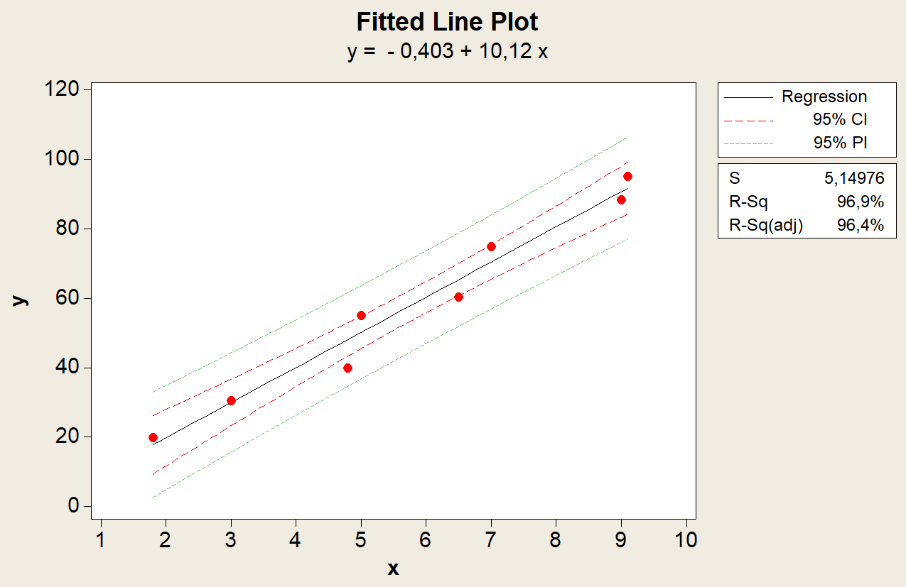
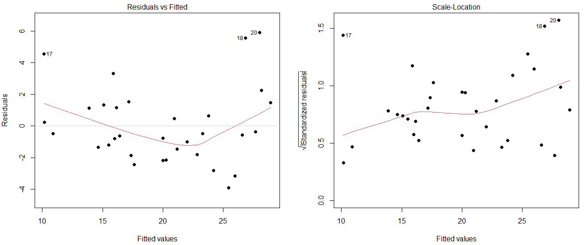
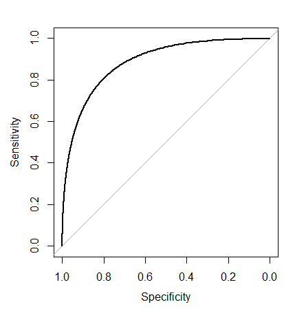

# Statistical Modelling
My statistical modeling projects for the corresponding MSc course.

#### Project 1: Simple linear models using Minitab
#### Example figure

#### Project 2: Multiple linear regression using R
#### Example figure

#### Project 3: Poisson and logistic regression using R
#### Example figure

